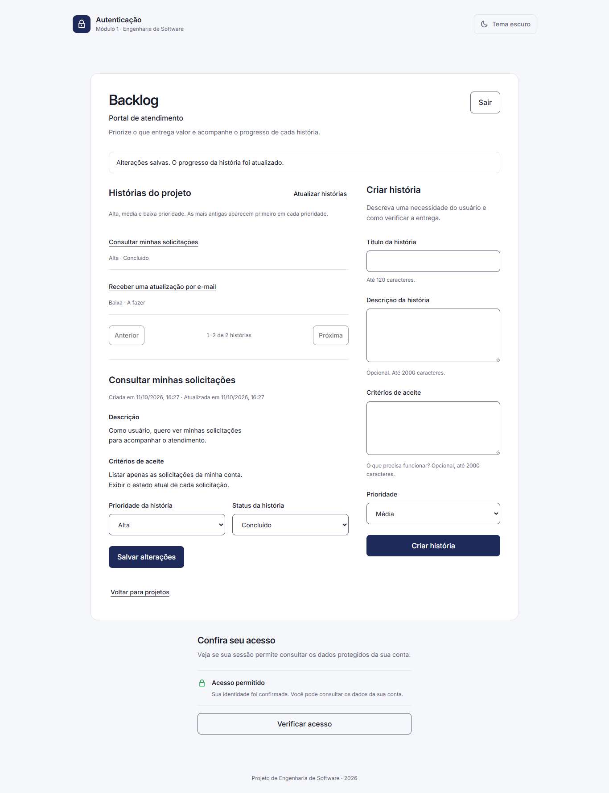
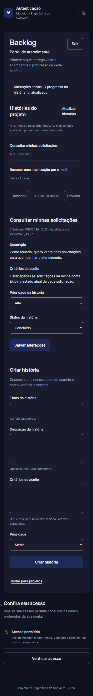

# Preparação da versão 0.5.0 — 01/11/2026

A suíte completa executou **152 testes aprovados, sem skips, em 181,392 s**,
usando `.venv/Scripts/python.exe -m unittest discover -s tests -v`. Os três
caminhos de backend estavam configurados para os checkouts da entrega. O
processo de testes recebeu `MAIL_PROVIDER=auto` e nenhuma variável `RESEND_*`.
As fixtures inicializaram APIs reais locais com SQLite, RSA e contas temporários;
não usaram banco de produção ou transporte real de e-mail.

Essa execução inclui os fluxos de MFA/confirmação/reset locais, revogação nos
consumidores, planejamento/papéis/quadro e as regressões do refinamento premium
para filtros móveis e contraste de foco. A revisão visual independente das
36 capturas e das correções está em [premium-frontend.md](premium-frontend.md).

O artefato de deploy foi reproduzido em diretório temporário copiando somente
`public/` e gerando a configuração das três APIs HTTPS: **37 arquivos**, com
`config.js` sem cache e sem arquivos privados ou padrões de segredos encontrados
na inspeção. Links locais de README e nove documentos foram conferidos sem
destinos ausentes; `git diff --check` passou. Arquivos locais de agentes,
Superpowers e `.local/` não estão rastreados.

O transporte Resend teve envio/recebimento real confirmado separadamente para o
titular. O remetente de teste atual limita os destinatários a essa conta. Essa
evidência de transporte não substitui teste externo ponta a ponta de reset ou
confirmação. IA real e contrato efetivo do módulo de revisão seguem pendentes.
Os testes e a preparação descritos aqui não comprovam push, tag, merge,
disponibilidade de produção ou deploy da versão 0.5.0.

## Histórico — validação adicional de 31/10/2026, funcionalidades locais

Na branch local `feat/remaining-user-stories`, a suíte completa com
`AUTH_BACKEND_PATH`, `PROJECTS_BACKEND_PATH` e `BACKLOG_BACKEND_PATH`
apontando para os worktrees locais executou **150 testes, todos passaram, sem
skips**, em 180,595 s. Comando: `python -m unittest discover -s tests -v`.

O Edge headless exercitou APIs reais em portas loopback, bancos SQLite
temporários e chaves próprias. Os fluxos novos incluem metadados/orçamento/
datas, papel personalizado, história orientada/MoSCoW/estimativa, arrastar para
ordenar e atualizar status, MFA com recuperação, confirmação de e-mail e reset.
Reset revoga a credencial anterior também em Projetos e Backlog. Parar a API de
Identidade durante uma edição retorna indisponibilidade, preserva os campos e
permite repetir a gravação após o reinício.

Testes controlados também verificam caixa de notificações, equipe/convite,
sessões e revogação, limites de inatividade/validade absoluta, renovação única,
cancelamento da primeira tela durante rotação e logout durante resposta tardia.
Retornar do fluxo de token público limpa também a identidade anterior, impedindo
que uma verificação de expiração remova o formulário de recuperação em seguida.
Recomendação simulada mostra janela de observação e exige decisão humana;
projetos em consulta ocultam ações de alteração de dados.
O editor compacto de membros preserva papéis personalizados e os prazos por
papel, inclusive concessões sem expiração, ao editar os papéis fixos.
Os testes de fronteira impedem HTTP/DOM nas camadas puras.

Inspeção desktop/claro e móvel/escuro preservou o guia visual existente; a tabela
usa rolagem horizontal em telas estreitas. O detector visual emitiu apenas
avisos sobre cores já presentes em DESIGN.md. Capturas com dados sintéticos
permanecem locais. Não houve publicação, SMTP externo ou IA real.

As limitações e os caminhos de teste estão em
[local-user-stories.md](local-user-stories.md) e
[backlog-status.md](backlog-status.md).

## Histórico das validações anteriores

# Validação do frontend 0.2.0 — 11/10/2026

## Arquitetura multicamadas — 30/10/2026

- Organização concluída preservando os arquivos atuais: apresentação, aplicação
  de conta/workspace, domínio/contratos e transporte HTTP. Sem mudança de versão,
  HTML/CSS, rotas públicas ou dados de produção. Ver [architecture.md](architecture.md).
- Baseline: 100 testes, 8 integrações puladas por ausência dos caminhos dos backends.
- RED de arquitetura: sessão importava transporte e quatro telas importavam
  clientes HTTP concretos. Após extração, testes dessas fronteiras passaram.
- Casos de uso e domínio: login/identidade/sessão, logout com respostas antigas,
  cancelamento, expiração, falha após emissão do token, troca de senha, leituras
  compostas, normalização de competências e alterações de história por papel.
- Revisão independente das quatro mudanças não encontrou regressão funcional ou
  de segurança; apontou uma lacuna de testes sem DOM. A correção adicionou execução
  real de conta/workspace e dos módulos puros em Worker sem DOM e com fetch bloqueado,
  mais proteção de imports/globais. A fixture negativa do verificador falhou antes
  da implementação e passou depois; os dez testes de conta e sete de fronteiras passaram.
- Integração com os três backends refatorados: primeiro 120 testes aprovados sem
  skips em 130,357 s; após reforço da verificação, **124 testes aprovados sem skips
  em 113,660 s**. A execução final usou a mesma descoberta `unittest` com um runner
  de diagnóstico que registra erros JS/requisições sem alterar os testes ou produto.
- Uma execução intermediária de 124 testes teve um timeout de 4 s ao preencher
  o e-mail ainda desativado no setup de `test_logout_then_other_login_ignores_late_project_response`.
  Seis repetições isoladas passaram em 6,302 s; o problema não se reproduziu na
  suíte final instrumentada. Não foi alterado código nem timeout para ocultá-lo;
  a causa desse episódio isolado não foi estabelecida.
- O fluxo de colaboração/perfil com duas contas e três APIs reais passou,
  incluindo aceite de convite, status por Desenvolvedor, promoção a PO e remoção.
- Ambiente local reiniciado com o código refatorado e os mesmos bancos locais:
  três readiness HTTP 200, CORS correto, login da conta de teste existente e
  listagem de projetos HTTP 200 pelo Edge, sem erros JavaScript. Nenhum registro
  foi apagado; esse smoke fez apenas login e consultas.
- PostgreSQL, Docker e Azure não foram revalidados nesta etapa; fixtures usam
  SQLite e RSA temporários. As evidências históricas abaixo não substituem esse limite.

Para reproduzir a suíte, prepare os quatro ambientes conforme o README e defina
`AUTH_BACKEND_PATH`, `PROJECTS_BACKEND_PATH` e `BACKLOG_BACKEND_PATH` com os checkouts
de Identidade, Projetos e Backlog que serão testados. Execute:

```powershell
.venv/Scripts/python.exe -m unittest discover -s tests -v
```

Os bancos dos testes reais são temporários e locais; não configure credenciais
de produção. Não há necessidade de acessar um arquivo de plano local para executar
ou interpretar os resultados acima.

## Conferência para PR — 30/10/2026

- Suíte completa: **100 testes aprovados, nenhum skip**, em 224.293 s, com
  as três APIs reais e SQLite/RSA temporários.
- Quatro regressões para falha/recarregamento do perfil, mudança remota de papel
  em membros e backlog e perda completa de acesso aos membros (404).
- Falha inicial do perfil mantém edição/Salvar desativados e oferece retentativa;
  atualização/reabertura consulta permissões atuais e remove controles revogados.
- Novos testes reproduziram as falhas antes das correções; a fixture de resposta
  atrasada do Backlog foi adaptada à consulta de permissões e voltou a passar.
- Revisão independente do frontend concluída; achados importantes corrigidos e
  diff final aprovado. Evidências anteriores abaixo referem-se aos estados históricos.
- Backends revalidados com PostgreSQL descartável: Identidade 200, Projetos 137,
  Backlog 194 aprovados sem skips. Checks API/container dos três PRs passaram.

## Colaboração/perfil 0.4.0 — 28/10/2026, somente local

- Suíte completa: **96 testes aprovados, nenhum skip**, em 131,831 s, com as três
  APIs reais e SQLite/RSA temporários. Nenhuma credencial ou banco remoto.
- Teste ampliado de duas contas passou separadamente em 13,943 s: código de convite,
  perfil, acesso Desenvolvedor/status, promoção a PO na UI/API, remoção e código usado negado.
- Backends completos com PostgreSQL descartável: Identidade 200, Projetos 137,
  Backlog 194 aprovados sem skips. ICU und preserva os testes de busca Unicode.
- Seis capturas locais em `.impeccable/review/`: perfil, backlog Desenvolvedor e
  membros; desktop claro 1366×900 e celular escuro 390×844, sem overflow horizontal.
  Revisão visual própria preservou Inter, tokens e identidade do módulo 6.
- Detector Impeccable manteve avisos históricos de paleta/Inter definidos pelo guia;
  não representam troca de marca ou dependência nova.
- Revisão independente deste lote indisponível por limite dos auxiliares;
  revisão própria e testes concluídos. Evidências históricas abaixo não a substituem.
- Tudo local: sem publicação, deploy, tag, push ou alteração de main.

Windows, Python 3.12.15 e Playwright com Microsoft Edge. A suíte completa executou
**63 testes aprovados, sem skips**, com os três caminhos de backend configurados.
O backend do backlog executou 118 testes aprovados e um skip PostgreSQL local opt-in.

Os quatro componentes foram exportados somente com arquivos públicos para árvores
novas; ambientes Python 3.12 foram instalados do zero e a suíte integrada foi
reexecutada usando exclusivamente esses checkouts, sem configuração privada do desenvolvedor.

## Evidência integrada

Cadastro pelo navegador → login → projeto → duas histórias → prioridade alta e
status concluído → reinício do backlog → história recuperada. Outra conta recebeu
404 nas quatro operações; história de outro projeto também ficou inacessível.
Sem token, 401. As três APIs desse teste usam apenas SQLite/RSA/contas temporários.

Separadamente, a instância de desenvolvimento no Neon confirmou TLS verify-full,
schema `backlog`, runtime com SELECT/INSERT/UPDATE e ausência de CREATE/DELETE/acesso
às tabelas dos outros módulos. Criação, alteração, leitura e recuperação após
reinício da API foram verificadas sem exclusão de registros ou schemas.

## Interface

Formulários validam título 1–120 Unicode e descrição/critérios até 2000; foco vai
ao primeiro erro. HTML aparece como texto; quebras de linha são preservadas.
Testes cobrem paginação, prioridade/status, reabertura, duplo envio, 401/404/503,
respostas antigas após troca de projeto/logout e sucesso seguido de recarga falha.
Essa falha confirma a gravação, sem reenviar automaticamente.
Quando a recarga retorna 401, o login preserva a confirmação de criação ou
atualização junto ao aviso de sessão encerrada. A normalização dos espaços Unicode
concorda com o backend; histórias antigas com espaços adicionais continuam legíveis.

Capturas geradas pela fixture com dados sintéticos, APIs reais temporárias e viewport
desktop 1366×900 / celular 390×844. Não incluem tokens, credenciais ou contas reais.





[Confirmação de criação preservada após a sessão expirar](screenshots/backlog-created-session-expired.png).
Essa captura usa respostas controladas para reproduzir POST 201 seguido de GET 401;
as duas capturas do backlog acima usam os três serviços reais temporários.

## Reproduzir e apresentar

Instale os ambientes e configure `AUTH_BACKEND_PATH`, `PROJECTS_BACKEND_PATH`,
`BACKLOG_BACKEND_PATH` como no [README](../README.md). Execute a suíte completa.
Sem nenhum caminho, seis integrações são puladas explicitamente.
Para renovar capturas sintéticas, a fixture de backlog aceita
`CAPTURE_BACKLOG_EVIDENCE` com um diretório local de saída.

Mostre uma necessidade do usuário e seus critérios, a entrega principal primeiro,
o progresso salvo e o bloqueio para outra conta. Isso demonstra organização e
acompanhamento de entregas, além do login. Grave/capture a demonstração e vincule
a versão específica do código publicada para a apresentação P6.

PostgreSQL destrutivo local não executou (sem banco loopback configurado; daemon
Docker indisponível). O smoke Neon é separado. Docker/deploy/CI/CD permanecem
fora da validação; equipes/RBAC e demais funções do módulo completo continuam futuras.
# Gerenciamento básico integrado — candidato 0.3.0 — 28/10/2026

- Baseline: 73 testes, com seis integrações opt-in puladas antes de configurar APIs.
- TDD do lote: seis testes novos falharam por ausência dos clientes/controles;
  os cenários passaram após implementar os contratos e formulários.
- **Suíte final: 85 testes aprovados, nenhum skip**, em 156,50 s, com
  `AUTH_BACKEND_PATH`, `PROJECTS_BACKEND_PATH` e `BACKLOG_BACKEND_PATH`
  apontando aos worktrees locais novos.
- O navegador usa as três APIs reais com SQLite, chaves e contas sintéticos:
  cria/edita/busca projeto com objetivo, refina textos/critérios de história,
  filtra por texto/status/prioridade, reinicia Backlog e reencontra dados;
  troca a senha, recebe saída local, senha antiga é recusada e nova autentica.
- Casos negativos incluem validação da política configurada, senha atual errada,
  conteúdo literal, falha de PATCH com rascunho preservado e logout com resposta
  de senha atrasada sem restaurar sessão, além das regressões anteriores.
- Revisão independente encontrou dois defeitos recuperáveis e os três cenários
  reproduzidos em RED passaram após correção: PATCH confirmado → recarga 401
  mantém aviso de sucesso; GET 503 ao atualizar preserva rascunhos de projeto/história.
- Seis capturas conferidas: Backlog, edição de projeto e troca de senha em desktop
  claro 1366×900 e celular escuro 390×844. Sem overflow horizontal; sistema visual
  navy/Inter preservado. DESIGN.md e seu sidecar não foram alterados.
- Detector executado uma vez: avisos de RGB/fontes correspondem aos tokens e à
  fonte Inter explicitamente fixados pelo sistema existente, sem mudança de paleta.

Verificação independente de persistência PostgreSQL dos backends: Identidade 156,
Projetos 114 e Backlog 149 aprovados sem skips. A busca Unicode depende de locale
compatível no PostgreSQL; Backlog foi validado com ICU/und. O navegador usa SQLite
temporário: sua evidência não substitui o teste PostgreSQL.

Sem publicação, push, merge, tags, grants remotos ou autoria/coautoria de IA.
Trocar senha encerra a sessão local; revogar JWT nos consumidores, MFA, equipes/RBAC
e recuperação por e-mail permanecem fora deste lote. Migração de Projetos e permissões
do banco devem ser executadas explicitamente pelo operador antes de publicar.
